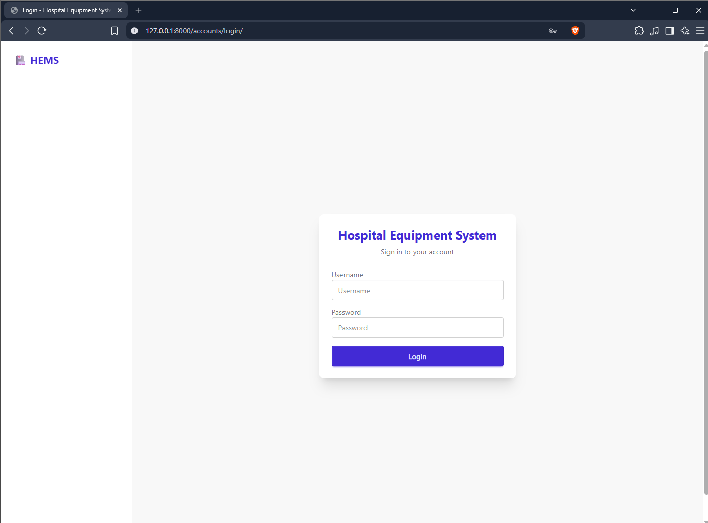
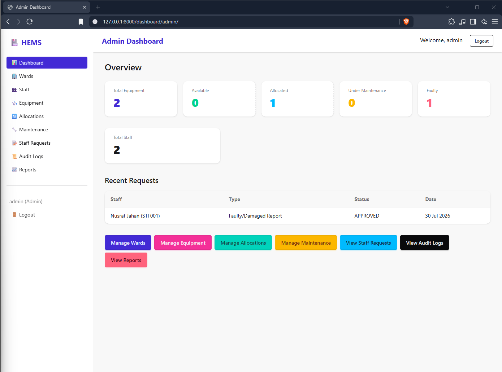
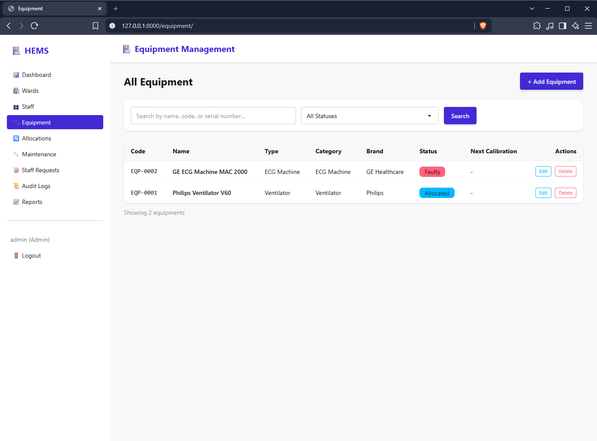
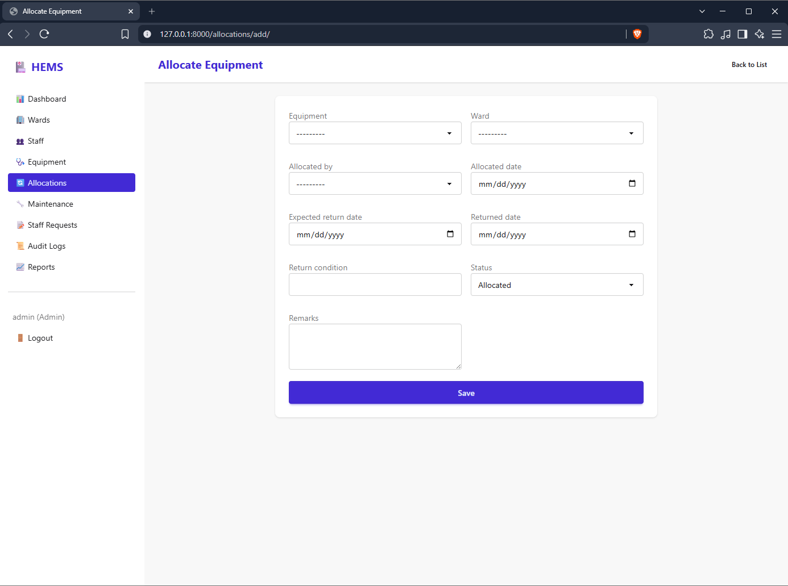
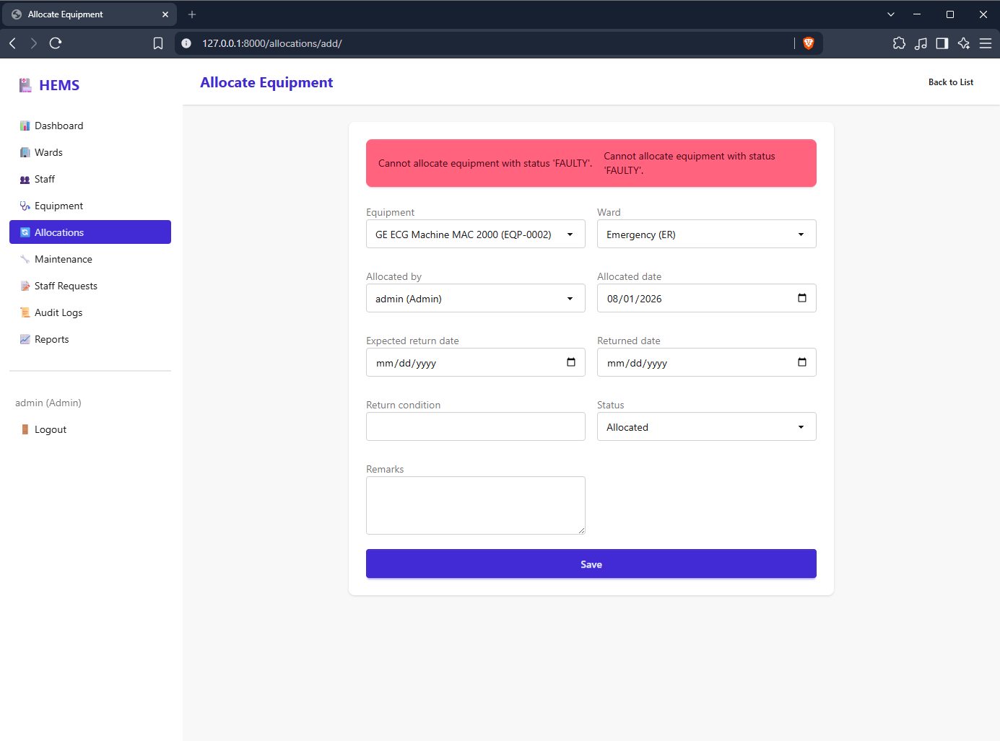
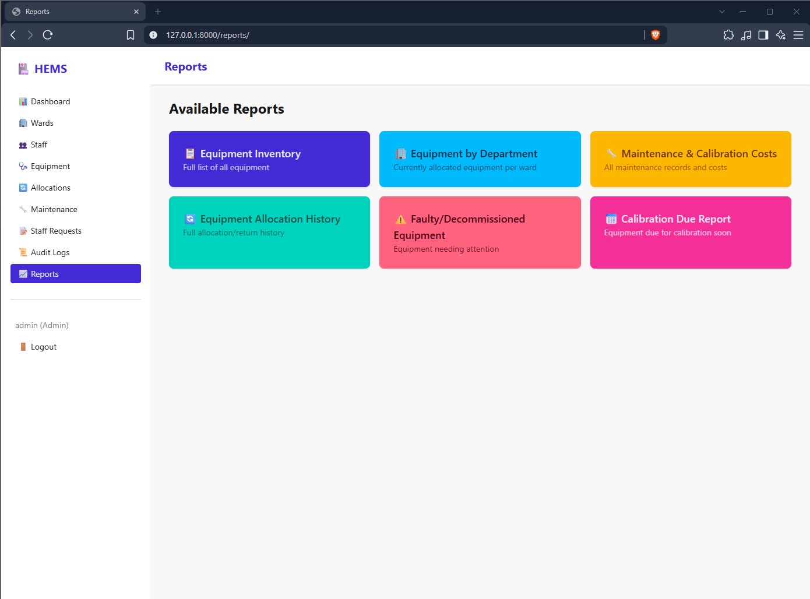
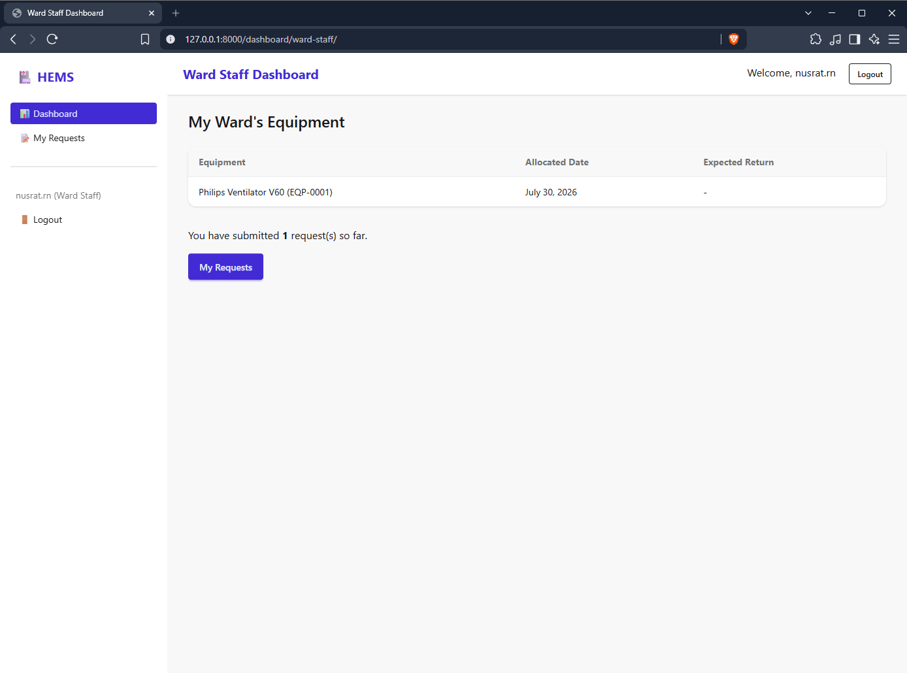

# 🏥 Hospital Medical Equipment Management System

A web-based system to manage medical equipment, department allocations, maintenance/calibration records, and staff requests across hospital departments — built with Django, Tailwind CSS, and DaisyUI.

## 📋 Overview

Hospitals often manage equipment like ventilators, infusion pumps, and monitors through paper logs and spreadsheets, leading to double-booking, missed calibration schedules, and lack of visibility into equipment status. This system centralizes equipment tracking, ward allocation, maintenance history, and staff requests on a single platform.

## ✨ Features

- **Role-based access control** — Admin, Biomedical Officer, and Ward Staff each get tailored dashboards and permissions
- **Equipment management** — Track ventilators, infusion pumps, ECG machines, monitors, wheelchairs, defibrillators, oxygen concentrators, and hospital beds with auto-generated equipment codes
- **Ward allocation** — Allocate equipment to departments with automated business rule enforcement (no double-booking, no allocating faulty/under-maintenance equipment)
- **Maintenance & calibration tracking** — Log issues, costs, vendors, and calibration certificates, with automatic equipment status sync
- **Staff requests** — Ward staff can request new equipment, report faults, or request replacements; Admin/Biomedical Officer can review and approve
- **Audit logs** — Read-only history of equipment-related actions
- **Reports & CSV export** — 6 report types including inventory, allocation history, maintenance costs, and calibration due
- **Dashboards** — Real-time statistics tailored to each role
- **Search & filtering** — Across wards, equipment, allocations, maintenance, staff, and requests
- **Data validation** — Unique equipment codes/serial numbers, phone number format validation, business rule enforcement

## 📸 Screenshots

### Login Page


### Admin Dashboard


### Equipment Management


### Equipment Form


### Business Rule Validation
Real-time validation prevents allocating equipment that is faulty or under maintenance:


### Reports


### Ward Staff Dashboard


## 🛠️ Tech Stack

- **Backend:** Django 6.0
- **Frontend:** Tailwind CSS + DaisyUI
- **Database:** PostgreSQL
- **Auth:** Django's built-in auth system with a custom User model (role-based)

## 🚀 Setup & Installation

1. **Clone the repository**
```bash
   git clone https://github.com/islamfarzana/hospital-equipment-system.git
   cd hospital-equipment-system
```

2. **Create and activate a virtual environment**
```bash
   python -m venv venv
   venv\Scripts\Activate.ps1   # Windows PowerShell
```

3. **Install dependencies**
```bash
   pip install -r requirements.txt
```

4. **Set up PostgreSQL database**

   Create a PostgreSQL database:
```bash
   createdb -U postgres your_db_name
```

5. **Set up environment variables**

   Create a `.env` file in the project root:

SECRET_KEY=your-secret-key-here
DEBUG=True
ALLOWED_HOSTS=127.0.0.1,localhost
DB_NAME=your_db_name
DB_USER=postgres
DB_PASSWORD=your_password
DB_HOST=localhost
DB_PORT=5432


6. **Run migrations**
```bash
   python manage.py migrate
```

7. **Create a superuser**
```bash
   python manage.py createsuperuser
```

8. **Start Tailwind CSS build (in a separate terminal)**
```bash
   python manage.py tailwind start
```

9. **Run the development server**
```bash
   python manage.py runserver
```

10. Visit `http://127.0.0.1:8000/accounts/login/` to log in.

## 👥 User Roles

| Role | Permissions |
|---|---|
| **Admin** | Manage users, staff, departments, equipment; view all reports |
| **Biomedical Officer** | Register/allocate equipment, manage maintenance, review staff requests |
| **Ward Staff** | View allocated equipment, submit requests, report faults |

## 📁 Project Structure

hospital_system/ Project settings
accounts/ Custom User, Staff, Designation models + auth
wards/ Ward/department management
equipment/ Equipment, categories, brands, vendors, audit logs
allocations/ Equipment-to-ward allocation with business rules
maintenance/ Maintenance & calibration records
requests_app/ Staff equipment requests
dashboard/ Role-based dashboards
reports/ Reports + CSV export
templates/ HTML templates (Tailwind/DaisyUI)


## 🔑 Business Rules Implemented

- Equipment cannot be allocated if its status is Under Maintenance, Faulty, or Decommissioned
- An equipment unit can only be actively allocated to one ward at a time
- Returning equipment automatically resets its status to Available
- Starting maintenance automatically sets equipment status to Under Maintenance; completing it resets to Available
- Equipment codes and serial numbers are unique and auto-generated

## 📄 License

This project was built as a learning exercise for Django development practices including models, ORM relationships, authentication, role-based permissions, and business rule implementation.